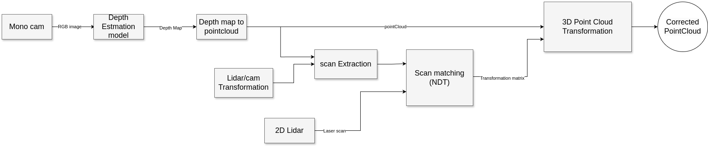

# 2D-Lidar-Aided-Depth-Estimation

## Overview
Estimating absolute depth using a single RGB image, without knowing the camera parameters, can be very challenging. However, what if we could enhance this estimation with precise additional information from a 2D LiDAR?

The objective of this project is to obtain a precise 3D point cloud using only an RGB camera and 2D LiDAR low-cost components easily found on basic robotic platforms. By exploiting the highly accurate depth measurements from the 2D LiDAR, which are limited to a single plane, we can correct depth information across the entire depth map.

## Assumptions
* There is no transformation along the z-axis, the 3D transformation matrix is equivalent to a 2D transformation matrix, with unity z-axis components.